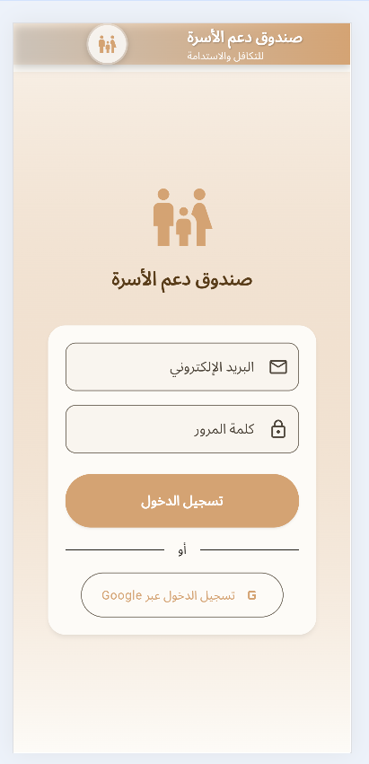
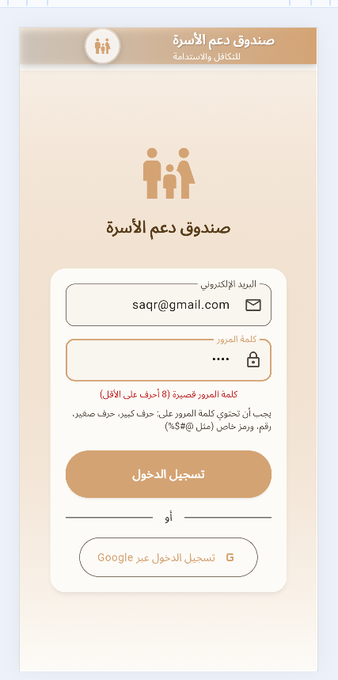
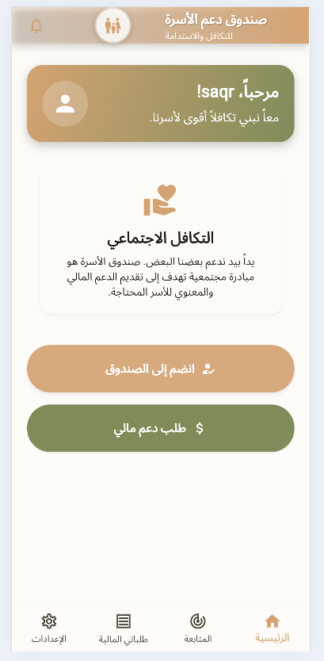
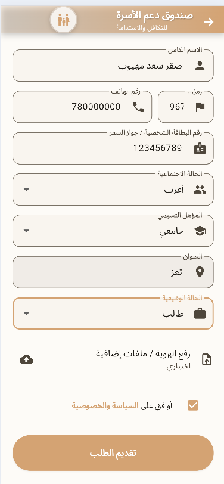
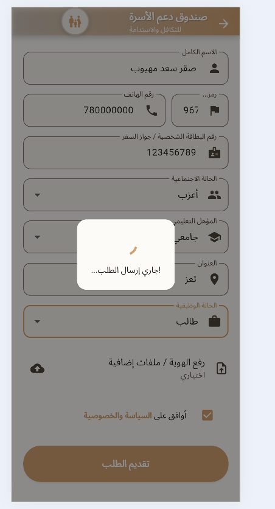
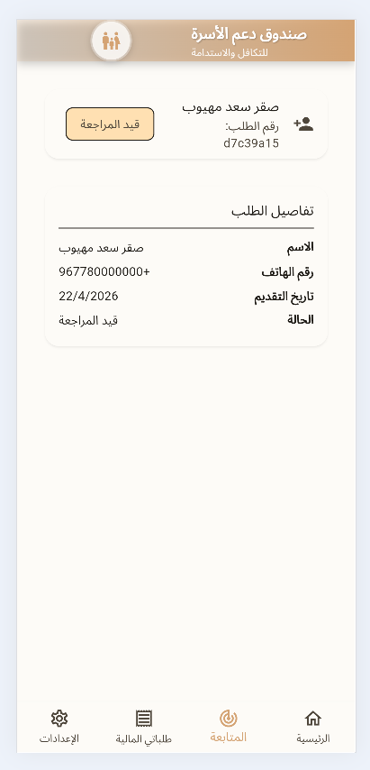
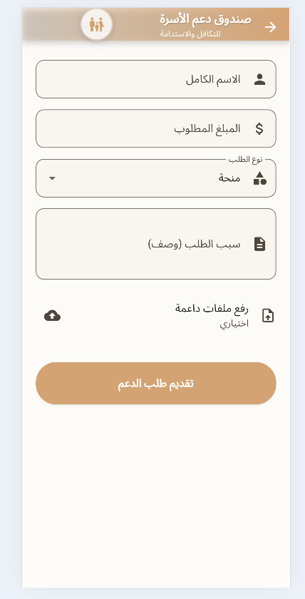
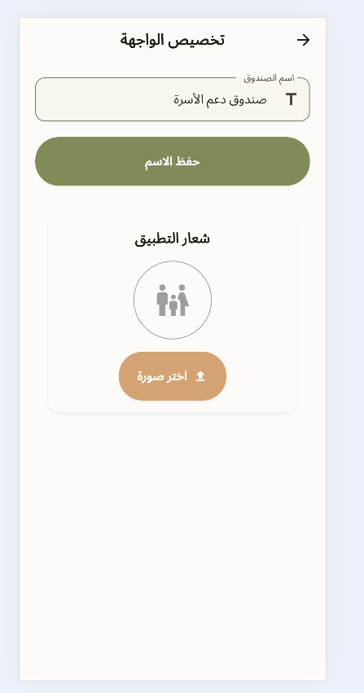
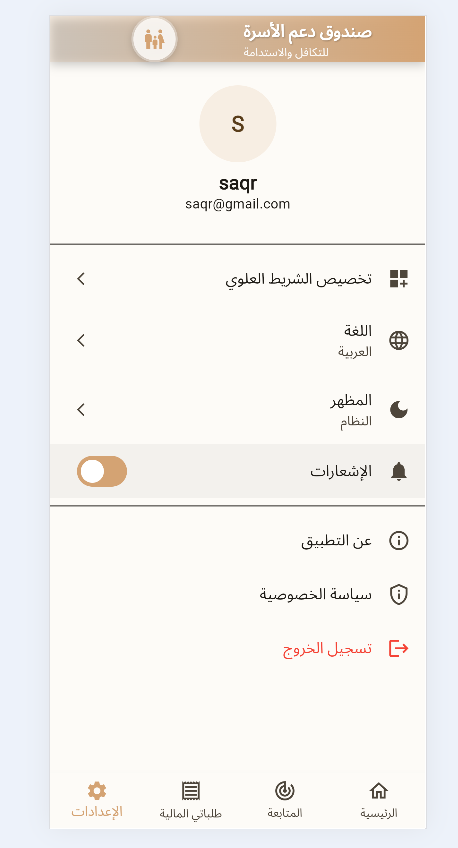
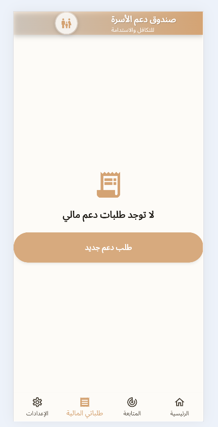

family_support_fund/
├── assets/
│   ├── fonts/
│   │   └── (اختياري: ملفات خطوط مثل Cairo)
│   └── images/
│       └── google_logo.png
│
├── lib/
│   ├── core/
│   │   ├── constants/
│   │   │   └── app_strings.dart
│   │   ├── providers/
│   │   │   ├── app_customization_provider.dart
│   │   │   └── app_settings_provider.dart
│   │   ├── routes/
│   │   │   └── app_router.dart
│   │   ├── theme/
│   │   │   ├── app_theme.dart
│   │   │   ├── color_schemes.dart
│   │   │   └── text_theme.dart
│   │   └── utils/
│   │       ├── size_config.dart
│   │       └── validators.dart
│   │
│   ├── features/
│   │   ├── about/
│   │   │   └── presentation/
│   │   │       └── screens/
│   │   │           └── about_us_screen.dart
│   │   ├── auth/
│   │   │   ├── presentation/
│   │   │   │   ├── screens/
│   │   │   │   │   └── login_screen.dart
│   │   │   │   └── widgets/
│   │   │   │       └── login_form.dart
│   │   │   └── providers/
│   │   │       └── auth_provider.dart
│   │   ├── financial_requests/
│   │   │   └── presentation/
│   │   │       └── screens/
│   │   │           └── financial_requests_screen.dart
│   │   ├── financial_support/
│   │   │   ├── presentation/
│   │   │   │   ├── screens/
│   │   │   │   │   └── support_request_screen.dart
│   │   │   │   └── widgets/
│   │   │   │       └── support_form.dart
│   │   │   └── providers/
│   │   │       └── support_provider.dart
│   │   ├── home/
│   │   │   └── presentation/
│   │   │       └── screens/
│   │   │           └── home_screen.dart
│   │   ├── join_fund/
│   │   │   ├── presentation/
│   │   │   │   ├── screens/
│   │   │   │   │   ├── join_request_screen.dart
│   │   │   │   │   └── request_status_screen.dart
│   │   │   │   └── widgets/
│   │   │   │       └── join_form.dart
│   │   │   └── providers/
│   │   │       └── join_request_provider.dart
│   │   ├── settings/
│   │   │   └── presentation/
│   │   │       └── screens/
│   │   │           ├── customization_screen.dart
│   │   │           └── settings_screen.dart
│   │   └── tracking/
│   │       └── presentation/
│   │           └── screens/
│   │               └── tracking_screen.dart
│   │
│   ├── l10n/
│   │   ├── app_ar.arb
│   │   ├── app_en.arb
│   │   └── app_localizations.dart
│   │
│   ├── shared/
│   │   ├── models/
│   │   │   └── user_model.dart
│   │   └── widgets/
│   │       ├── custom_app_bar.dart
│   │       ├── custom_button.dart
│   │       ├── custom_text_field.dart
│   │       ├── loading_overlay.dart
│   │       └── main_scaffold.dart
│   │
│   └── main.dart
│
├── pubspec.yaml
├── README.md
└── .gitignore
```

---

# Family Support Fund App

<p align="center">
  
</p>

<p align="center">
  A modern Flutter application built to foster social solidarity and provide financial support within family communities. The app allows users to join a cooperative fund, request financial aid, track their requests, and customize the interface.
</p>

<p align="center">
  
  
  
  
</p>

---

 📱 Features

- **User Authentication**
  - Sign in with email and password.
  - Google Sign-In integration.
  - Real-time email format validation.
  - Strong password enforcement with instant feedback.

- **Home Dashboard**
  - Personalized welcome message.
  - Social solidarity statement.
  - Trust indicators (families served, 24/7 support, 100% transparency).
  - Quick actions to join the fund or request support.

- **Join the Fund**
  - Comprehensive membership application form.
  - Live validation for all fields.
  - Optional document upload.
  - Terms & conditions acceptance.
  - Request tracking with unique ID and status.

- **Financial Support Requests**
  - Submit grant or loan requests.
  - Specify amount and purpose.
  - Attach supporting documents.
  - View all submitted requests in a dedicated tab.

- **Tracking & History**
  - Bottom navigation bar with four sections: Home, Join Tracking, Financial Requests, Settings.
  - View the status of your join request (Under Review / Approved / Rejected).
  - List all previous financial support requests.

  **Settings & Customization**
  - Toggle between Light, Dark, and System themes.
  - Switch between Arabic and English languages.
  - Enable/disable push notifications.
  - **Customizable App Bar**: Change the fund name and upload a custom logo (persists across sessions).
  - Detailed "About Us" page with vision and mission.
  - Privacy policy and contact information.

- **Responsive & Adaptive UI**
  - Fully supports RTL (Arabic) and LTR (English) layouts.
  - Material 3 design with custom color schemes.
  - Clean separation of presentation and business logic using Provider.

---

## 🏗️ Architecture & Tech Stack

| Category               | Technology / Pattern |
|------------------------|----------------------|
| **Framework**          | Flutter (SDK >=3.0)  |
| **State Management**   | Provider             |
| **Routing**            | GoRouter (declarative) |
| **Localization**       | `flutter_localizations` + ARB files |
| **Persistence**        | SharedPreferences (for settings & logo) |
| **File Upload**        | FilePicker, ImagePicker |
| **Code Style**         | Clean Architecture Lite, feature-first structure |
| **Theming**            | Custom `ThemeData` with `ColorScheme` & `TextTheme` |

---

## 📂 Project Structure

The project follows a **feature-first** structure with clear separation of concerns:

```

lib/
├── core/               # Core functionality (theming, routing, utilities, global providers)
├── features/           # Feature modules (auth, home, join_fund, financial_support, settings, tracking, about)
├── l10n/               # Localization files (ARB)
├── shared/             # Shared widgets and models
└── main.dart           # Application entry point

```

For a full directory tree, refer to the [Project Structure](#-project-structure-tree) section below.

---

## 🚀 Getting Started

### Prerequisites
- Flutter SDK (>=3.16.0)
- Dart SDK (>=3.2.0)
- Android Studio / VS Code with Flutter plugins
- A device or emulator for testing

### Installation

1. **Clone the repository**
   ```bash
   git clone https://github.com/saqrsaad/-Family_Support_Fund_App.git
   cd family_support_fund
```

1. Install dependencies
   ```bash
   flutter pub get
   ```
2. Generate localization files
   ```bash
   flutter gen-l10n
   ```
3. Run the app
   ```bash
   flutter run
   ```

Note for Web: The app is fully web-compatible. The custom logo is stored as Base64 to work across all platforms.

---

⚙️ Configuration

Google Sign-In

To enable Google Sign-In, follow these steps:

1. Android: Place your google-services.json in android/app/.
2. iOS: Place your GoogleService-Info.plist in ios/Runner/.
3. Web: Add your OAuth client ID in web/index.html.

If you don't configure Google Sign-In, the button will fall back to a dummy implementation (as used in the demo).

Changing Default App Bar Name

You can set a default name in lib/core/providers/app_customization_provider.dart:

```dart
String _appBarTitle = 'Family Support Fund'; // Change this
```

---

🎨 Theming & Customization

The app uses a warm, trustworthy color palette (Gold & Olive) to reflect solidarity and growth. All styling is centralized in lib/core/theme/.

· Light Theme: Soft backgrounds with high contrast.
· Dark Theme: Deep surfaces with vibrant accents.
· Dynamic Color Roles: Ensures accessibility and visual harmony.

Customization settings (theme mode, language, notifications, and logo) are persisted using SharedPreferences.

---

📦 Dependencies

Package Purpose
provider State management
go_router Routing with deep linking support
shared_preferences Local storage for settings and logo
image_picker Picking custom logo from gallery
file_picker Uploading identity/support documents
google_fonts Custom typography (Cairo)
uuid Generating unique request IDs
intl Internationalization
flutter_localizations Localization delegates

---

📸 Screenshots

<p align="center">
  
    
  
    
  
  
  
  
    
  
  </p>

---

🧪 Testing

The app includes basic validation logic and simulated async operations. For production, replace the dummy Future.delayed calls with real API integrations.

---

🤝 Contributing

Contributions are welcome! Please follow these steps:

1. Fork the repository.
2. Create a new branch (git checkout -b feature/amazing-feature).
3. Commit your changes (git commit -m 'Add some amazing feature').
4. Push to the branch (git push origin feature/amazing-feature).
5. Open a Pull Request.

---

📄 License

This project is licensed under the MIT License. See the LICENSE file for details.

---

 Acknowledgements

· Flutter team for the amazing framework.
· All open-source package maintainers.
· Fonts: Google Fonts (Cairo).

---

📬 Contact

For any inquiries or support, please open an issue on GitHub.
Author
 Saqr Saad
 GitHub:
 https://github.com/saqrsaad
 

---


<p align="center">Built with ❤️ for family solidarity</p>

